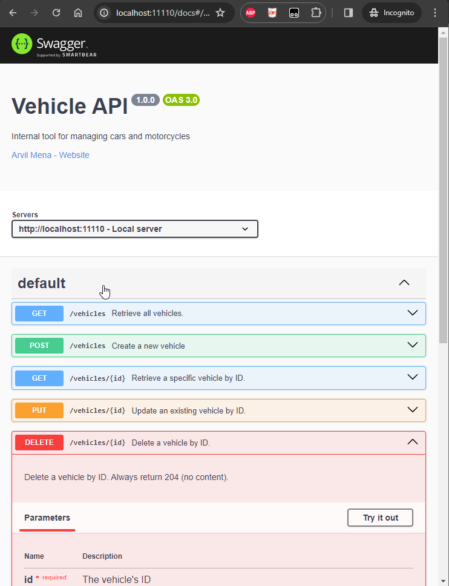

# Berkshire AP Coding Challenge
## Simple Vehicle API

### Requirements

- [NodeJS >= 20](https://nodejs.org/en)
- [pnpm](https://pnpm.io/installation#using-npm)
- [Docker](https://www.docker.com/) _(optional if you already have local Postgres)_

### Installation and database setup

- Clone this repository
- run `pnpm install`
- copy `.env copy` to `.env`
- update `.env` to your corresponding environment settings
- if using Docker, start docker: `docker compose up dev -d`
  - might take a while if your Docker hasn't downloaded Postgres image before
- once the DB/Docker is running, execute the DB migration files: `pnpm db:migrate`

### Running locally

To start the API endpoints, simply run:

```pnpm app:serve:dev```

### Prepopulating or Seeding Data

To load dummy data to the database, simply run:

```pnpm db:seed```

### Documentation

#### Open API Spec
A [OpenAPI specification document](https://spec.openapis.org/oas/v3.1.0) is automatically generated at: [http://localhost:11110/open-api](http://localhost:11110/open-api). You can import it to your favorite API Client, like Postman, Insomnia, etc.

#### Swagger UI
A more UI friendly documentation is served at [http://localhost:11110/docs](http://localhost:11110/docs) powered by [SwaggerHub UI](https://swagger.io/tools/swagger-ui/). It allows anyone to visualize and interact with the API’s resources without having any of the implementation logic in place. In addition, this page can also serve as testing client if wanted.




### Testing

#### Via Swagger UI

The [http://localhost:11110/docs](docs) interactive docs allows you to test each endpoint from your browser. The endpoint specification, schema and parameters are defined in the document.

#### Via API Client

The [http://localhost:11110/open-api](open-api page) will generate a OpenAPI v3 Spec that you can import on your API client. Once imported, you can use your API client to do the testing.

#### Automated Testing

A end-to-end (e2e) testing system is also created to test all scenarios, including actual creation and deletion of Entities. View the [Spec file to see the test coverage](https://github.com/arvilmena/coding-challenge--berkshire-ap/blob/92fb50070cf7997f10583231eb4168d236cf8c8d/apps/berkshire-ap-coding-challenge-e2e/src/berkshire-ap-coding-challenge/berkshire-ap-coding-challenge.spec.ts). To run the e2e test just issue:

```pnpm test:e2e```

> :warning: **The E2E Test involves actual entity creation**: Your DB id will be incremented. All created entities shall be deleted at the end of E2E considering all the test passed.

### Credits

- [NestJS](https://nestjs.com/) for backend framework
- [NX](https://nx.dev/) for monorepo
- [TypeScript](https://www.typescriptlang.org/) for Developer Experience
- [ts-rest](https://ts-rest.com/) for end-to-end typesafety
- [Drizzle](https://orm.drizzle.team/) for DB ORM and automated migration
- [Zod](https://zod.dev/) for making sure all parameters, input and output follows the expected shape/type
- [PostgresSQL](https://www.postgresql.org/) for DB engine